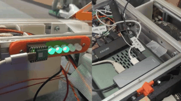

# Indicator Device
with uart, recieve 0 and 1 command.
0 set led red, 1 set led green.

MCU: [Seeed Studio XIAO SAMD21](https://www.switch-science.com/products/6335?_pos=2&_sid=e9998fc4d&_ss=r)  
LED: [Neopixel](https://www.switch-science.com/products/1802)  

use with [indicator-host](https://github.com/acaValkyrie/indicator-host).

&darr; When the USB cable is unplugged, the corresponding LED changes from green to red.  
